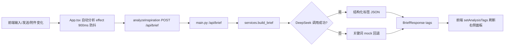
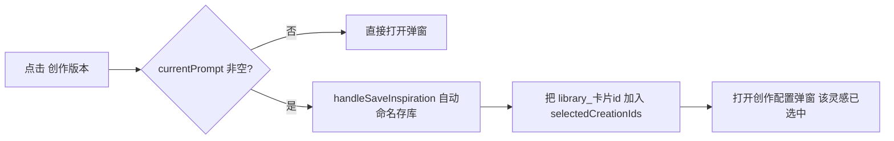

## 用户需求

1. 在新建创作历史、输入文本并点击"创作版本"时，默认把输入内容存入灵感库（自动命名），并在弹出的创作配置弹窗中默认选中这条灵感。
2. 右侧"实时标签"面板在每次对话状态更新时，调用一次 DeepSeek 分析每个分类下的标签。
3. 使用提供的 DeepSeek API Key（直接写入代码），模型为 `deepseek-v4-pro`，参考官方文档调用。

## 产品概述

声因 Sonic Seed 是面向音乐创作者的 AI 灵感管理与 Demo 协作工具。本次改动聚焦创作工作台两处体验升级：创作版本与灵感库的自动联动，以及实时 AI 标签从关键词模拟升级为真实 DeepSeek 分析。

## 核心功能

- **创作版本自动存灵感库并预选**：点击"创作版本"时，将当前输入框文本以自动生成的名称存入灵感库，并自动在创作配置弹窗中选中该灵感（seed）。
- **实时标签接入 DeepSeek**：每次对话/输入/附件状态变化（含发送消息后）触发一次 DeepSeek 调用，按"主题/情绪/场景/适用位置"四类返回每类的 value 与 detail，并刷新右侧 AI 标签面板。

## 技术栈

- 后端：Python FastAPI + httpx（已装 0.28.1），SQLite；复用现有 `build_brief` 入口与 `POST /api/brief`。
- 前端：React 19 + TypeScript + Vite；`frontend/.env.local` 已配 `VITE_API_BASE_URL=http://localhost:8000`，自动分析已走 `/api/brief`。
- DeepSeek：`deepseek-v4-pro`，OpenAI 兼容端点 `https://api.deepseek.com/chat/completions`，`Authorization: Bearer <key>`，`response_format: {type:"json_object"}`。

## 实现方案

### 总体策略

DeepSeek 调用放在**后端 `build_brief`**（前端已连后端，避免浏览器 CORS 与 key 暴露）；API Key 作为常量直接写在 `services.py`，并用环境变量 `DEEPSEEK_API_KEY` 提供覆盖能力。前端复用已有的 900ms 防抖自动分析 effect，仅补充 `messages` 依赖，使"发送消息"也算一次对话状态更新。

### 关键决策与权衡

- **后端代理而非前端直连**：规避 CORS、隐藏付费 key，且后端 `httpx` 已就绪；与现有 `/api/brief` 架构一致，改动面最小。
- **保留关键词 mock 作为回退**：DeepSeek 超时/报错/JSON 解析失败时回退到现有 `build_brief` 关键词逻辑，保证 UI 永远有标签，不阻塞创作。
- **四类标签固定顺序与标签名**：沿用 `initialTags` 的"主题/情绪/场景/适用位置"，DeepSeek 仅填充 value/detail，避免标签错乱。
- **手动分析已有 AI 消息追加**，自动分析（auto）不追加消息，保持面板干净；发送后 draft 清空，`runAnalysis` 因 prompt 为空提前返回，不会在发送后产生多余 DeepSeek 调用。

### 性能与可靠性

- 前端已做 900ms 防抖，空闲后才发请求，最多每 900ms 一次 DeepSeek 调用。
- 后端使用同步 `httpx.Client(timeout=30)`，FastAPI 在线程池执行，不阻塞事件循环；关闭 `thinking`/降低推理强度以缩短时延。
- 任何异常均回退 mock 并 `source="backend"`，前端状态显示"后端已同步"，不会出现"分析中"卡死。

## 实现注意

- 后端 `build_brief` 失败回退逻辑需复用原函数体（改名为 `_keyword_brief_fallback`），不要删除。
- `cardToCreationSeed` 生成 seed id 为 `library_${card.id}`；选中需写入 `selectedCreationIds`，而该 state 的自动全选 effect 在 `creationSelectionInitializedRef` 置位后只做保留、不会自动加新卡，因此必须在保存灵感后**显式**追加 `library_${card.id}`。
- 仅在 `currentPrompt` 非空时执行自动存库，避免空内容污染灵感库；重复点击"创作版本"可先按 content 去重（可选增强）。
- 不改动 `localBrief`（前端离线兜底），当前前后端已连通，DeepSeek 路径生效。

## 架构设计

数据流（新增 DeepSeek 环节，其余不变）：



创作版本联动（前端内闭环）：



## 目录结构

```
backend/app/
├── services.py   # [MODIFY] 新增 DEEPSEEK 常量与 call_deepseek_brief()；build_brief() 改为先调 DeepSeek，失败回退关键词 mock；原 mock 逻辑改名 _keyword_brief_fallback() 保留
└── main.py       # [CHECK] 确认 POST /api/brief 直接返回 build_brief 结果（BriefResponse），无需改逻辑
frontend/src/
├── App.tsx       # [MODIFY] ① handleSaveInspiration 改为返回保存的卡片并支持可选 name；② 新增 handleCreateVersion() 默认存灵感库+预选并绑定"创作版本"按钮；③ 自动分析 effect 依赖数组增加 messages
└── api.ts        # [NO CHANGE] analyzeInspiration 已连后端走 /api/brief，无需改
```

## 关键代码结构

```python
# backend/app/services.py
DEEPSEEK_API_KEY = os.getenv("DEEPSEEK_API_KEY", "")
DEEPSEEK_MODEL = "deepseek-v4-pro"
DEEPSEEK_URL = "https://api.deepseek.com/chat/completions"
TAG_LABELS = ["主题", "情绪", "场景", "适用位置"]

def call_deepseek_brief(text: str, mode: str, attachment_count: int) -> dict:
    """调用 DeepSeek 返回 JSON：{title, summary, suggestedStyle,
    tags: {主题:{value,detail}, 情绪:{value,detail}, 场景:{value,detail}, 适用位置:{value,detail}}}。
    失败时抛异常，由 build_brief 回退。"""

def build_brief(payload: BriefRequest) -> BriefResponse:
    # 优先 call_deepseek_brief，异常则 _keyword_brief_fallback(payload)
```